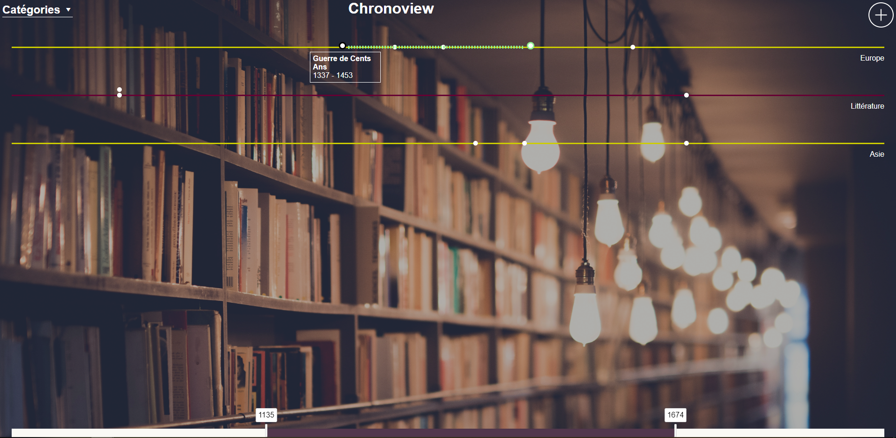
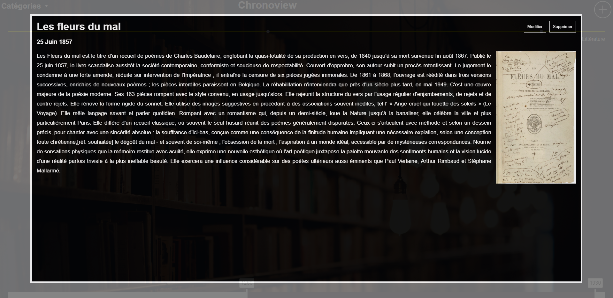

# Dernier projet scolaire - Chronoview

Ceci est le dernier projet que j'ai fait avant d'obtenir mon diplôme d'informaticienne (CFC avec maturité professionnelle). C'était un projet libre et j'ai choisit de faire un site permettant de comparer les événements s'étant déroulés dans le monde à différentes époques.

L'utilisateur peut créer plusieurs catégories auquelles il ajoute des événements. Il peut ensuite afficher jusqu'à 8 catégories à la fois et choisir la période à représenter avec le slider en bas.

Chaque point blanc est un événement, quand l'on passe la souris dessus, une petite boxe avec le titre et la date de début/fin de l'événement s'affiche. S'il s'est déroulé sur plusieurs jours, des traits-tirés indiquent sa durée.

On peut cliquer sur un point pour qu'une lightbox avec bien plus de détails apparaissent.

J'ai fait ce site en HTML/CSS, Jquery, PHP & MySQl en à peu près 2 semaines. Une documentation technique est disponible dans le sous-dossier "doc"
